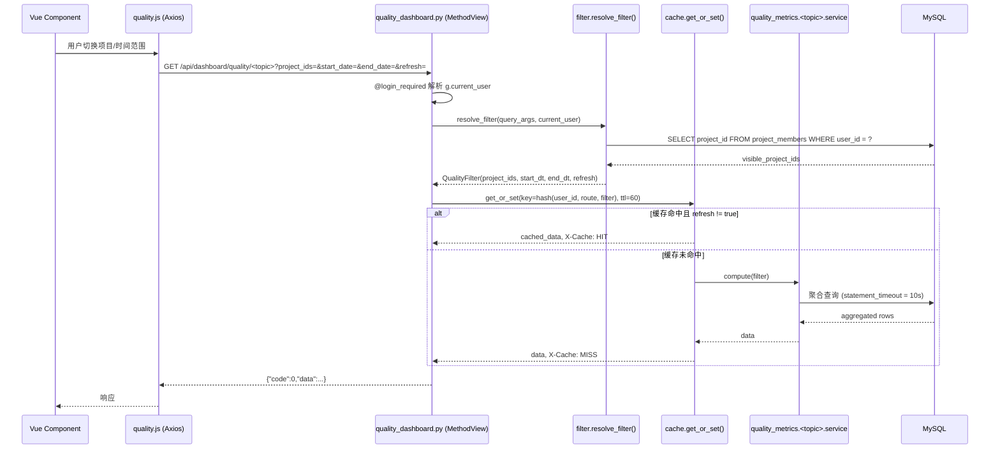

# Design Document

## Overview

本设计文档基于 `requirements.md` 中描述的"质量数据统计（大数据看板）"特性，将现有 Dashboard 页面从"5 张总数卡片 + 模拟列表"扩展为"基础统计 + 质量看板"双区域结构。设计严格遵守现有平台约束：

- **后端**：Flask + flask-smorest（MethodView）+ SQLAlchemy + MySQL，统一响应结构 `{"code": 0, "data": ...}` / `{"code": 1, "message": ...}`，`@login_required` 鉴权，`project_members` 项目级隔离。
- **前端**：Vue 3 + Vite + Element Plus，新增 ECharts 5（按需引入）作为图表底座，全部复用现有 `client/src/api/request.js` Axios 封装与 `MainLayout`。
- **数据来源**：仅基于现有持久化表 `projects / apis / api_folders / test_case_management / test_case_api_bindings / test_results / test_cases / bugs / requirements / sprints / operation_logs / project_members / users`，不新增持久化表；仅在必要时新增聚合 SQL 索引（Alembic 迁移）。

设计目标是：

1. **平滑迁移**：保留 `GET /api/dashboard/stats` 与 5 张 Basic_Stats_Card，前端在其下方以 Tab/Section 形式承载质量看板。
2. **横向扩展**：将 7 大主题（执行 / Bug / 覆盖 / 需求 / 项目总览 / 团队效能 / 导出）抽象为统一的"过滤 → 聚合服务 → 缓存 → 序列化"流水线，新增主题只需新增一个 service 函数 + 一个 MethodView。
3. **可观测、可控**：内置 60s TTL 缓存层、`X-Cache: HIT/MISS` 响应头、查询超时熔断、统一异常日志，避免高代价聚合查询拖慢系统。
4. **可降级**：对当前数据模型不支持的指标（按模块维度执行统计、需求-用例精确关联、按执行人维度统计）通过 `metric_basis` / `association_mode` 字段显式标注降级方案，与需求文档保持一致。

### 设计决策摘要

| 决策点 | 选择 | 理由 |
|--------|------|------|
| 蓝图组织 | 将质量统计独立为 `quality_dashboard_blp`（前缀 `/api/dashboard/quality`），与现有 `dashboard_blp`（`/api/dashboard`）并列 | `dashboard.py` 已有意义明确的轻量职责（基础卡片），新主题代码量较大，单文件易膨胀；独立蓝图便于路由解耦与测试隔离。 |
| 服务层位置 | 新建 `app/services/quality_metrics/` 包，按主题拆分 (`execution.py`、`bug.py`、`coverage.py`、`requirement.py`、`project_overview.py`、`team.py`、`export.py`、`filter.py`、`cache.py`) | 保持单文件 < 300 行；`app/routes/quality_dashboard.py` 仅做路由 + 参数解析，所有 SQL 聚合下沉到 service 层，方便单元/属性测试。 |
| 图表库 | **ECharts 5**（`echarts` + 按需注册 use 模块） | 1) 国内项目主流选择，文档/社区资料丰富；2) 与 Element Plus 风格不冲突；3) 支持折线/柱状/饼图/环形/雷达/堆叠/燃尽所有所需图型；4) 体积可通过按需引入控制；5) Vue3 项目无需额外封装，直接挂载 DOM 即可。Element Plus 自身不提供图表组件。 |
| 缓存实现 | 进程内 `OrderedDict + threading.Lock` 简易 TTL 缓存（`app/services/quality_metrics/cache.py`），不引入 Redis/flask-caching | 60s TTL 量级足够，单机部署形态下进程内即可。如未来横向扩展再替换为 Redis。 |
| Excel 导出 | 复用已在 `requirements.txt` 的 `openpyxl` | 已有依赖，避免新增运行时风险。 |
| PDF 导出 | 新增 **可选** 依赖 `reportlab`，未安装时 PDF 接口返回 HTTP 501 | Requirement 10.7 显式要求"未安装 PDF 依赖时降级"。`reportlab` 是 Python 生态最稳定的 PDF 生成库，纯 Python 实现，无外部 wkhtmltopdf 依赖。 |
| 时间范围参数 | 后端使用 `datetime` 半开区间 `[start_date 00:00:00, end_date+1day 00:00:00)` | 避免日期边界 off-by-one；前端展示按 `start_date / end_date` 闭区间。 |

## Architecture

### 总体分层

```mermaid
flowchart LR
    subgraph FE[Frontend - Vue 3 + Element Plus + ECharts]
        DV[Dashboard.vue]
        FB[QualityFilterBar.vue]
        TC[ExecutionTrendCard.vue]
        BC[BugAnalysisCard.vue]
        CC[CoverageCard.vue]
        RC[RequirementCard.vue]
        PC[ProjectOverviewCard.vue]
        EC[TeamEfficiencyCard.vue]
        XC[ExportDialog.vue]
        DV --> FB
        DV --> TC
        DV --> BC
        DV --> CC
        DV --> RC
        DV --> PC
        DV --> EC
        DV --> XC
    end

    subgraph API[client/src/api]
        DJS[dashboard.js<br/>quality.js]
    end

    FB -. emit filter .-> DJS
    TC --> DJS
    BC --> DJS
    CC --> DJS
    RC --> DJS
    PC --> DJS
    EC --> DJS
    XC --> DJS

    subgraph BE[Backend - Flask + flask-smorest]
        R1[/api/dashboard/stats<br/>dashboard.py - 保留/]
        R2[/api/dashboard/quality/*<br/>quality_dashboard.py/]
        SCH[schemas/quality_dashboard.py]
        FILT[services/quality_metrics/filter.py]
        CACHE[services/quality_metrics/cache.py]
        SVC[services/quality_metrics/<br/>execution.py / bug.py / coverage.py /<br/>requirement.py / project_overview.py /<br/>team.py / export.py]
        DJS -. HTTP .-> R1
        DJS -. HTTP .-> R2
        R2 --> SCH
        R2 --> FILT
        R2 --> CACHE
        R2 --> SVC
    end

    subgraph DB[(MySQL)]
        T1[projects / apis / api_folders]
        T2[test_case_management /<br/>test_case_api_bindings / test_cases]
        T3[test_results]
        T4[bugs / requirements / sprints]
        T5[operation_logs / project_members /<br/>users / roles]
    end

    SVC --> T1
    SVC --> T2
    SVC --> T3
    SVC --> T4
    SVC --> T5
    FILT --> T5
```

### 请求生命周期



### 蓝图与 URL 前缀

| 蓝图变量 | URL 前缀 | 文件 | 范围 |
|----------|----------|------|------|
| `dashboard_blp` (保留) | `/api/dashboard` | `app/routes/dashboard.py` | `GET /stats` |
| `quality_dashboard_blp` (新增) | `/api/dashboard/quality` | `app/routes/quality_dashboard.py` | 7 大主题 + 导出，全部 `MethodView` |

注册位置：`app/flask_app.py` 中 `from app.routes.quality_dashboard import quality_dashboard_blp` 后 `api.register_blueprint(quality_dashboard_blp)`，与现有 `dashboard_blp` 注册并列。

## Components and Interfaces

### Backend 模块

#### `app/routes/quality_dashboard.py`

每个主题对应一个 `MethodView` 子类，类内只做 4 件事：

1. 调用 `parser` 解析查询参数（flask-smorest `@blp.arguments(QualityFilterSchema, location="query")`）。
2. 调用 `filter.resolve_filter(args, g.current_user)` 得到 `QualityFilter`。
3. 调用 `cache.get_or_set(...)` 包装的对应 service 函数。
4. 用 `jsonify` 返回 `{"code":0,"data":...}`，并在 `flask.after_this_request` 中追加 `X-Cache` 响应头。

异常统一由 `_handle_quality_exception(fn)` 装饰器捕获：参数错误抛 `QualityFilterError` → 400；权限相关抛 `QualityForbiddenError` → 403；查询超时抛 `QualityTimeoutError` → 504；其余抛 `Exception` → 500 并写入 `logs/info.log`。

```python
# 简化示意（仅展示骨架）
@quality_dashboard_blp.route("/execution/trend")
class ExecutionTrendView(MethodView):
    @quality_dashboard_blp.arguments(QualityFilterSchema, location="query")
    @quality_dashboard_blp.response(200, QualityResponseSchema)
    @login_required
    @handle_quality_exception
    def get(self, args):
        qf = resolve_filter(args, g.current_user)
        data, hit = get_or_set(
            user_id=g.current_user.id,
            route="execution/trend",
            filter_=qf,
            compute_fn=lambda: execution.compute_trend(qf),
        )
        _attach_cache_header(hit)
        return jsonify({"code": 0, "data": data})
```

#### `app/services/quality_metrics/`

| 文件 | 关键函数 | 主表/查询 |
|------|----------|-----------|
| `filter.py` | `resolve_filter(args, user) -> QualityFilter`<br/>`compute_visible_project_ids(user) -> set[int]` | `project_members` (admin 角色 → 全集)；校验 `start_date/end_date`、跨度 365、`project_ids ⊆ visible` |
| `cache.py` | `get_or_set(user_id, route, filter_, compute_fn)`<br/>`invalidate_user(user_id)` | 进程内 `OrderedDict`，键 = `sha1(user_id|route|sorted(filter.dict()))`，TTL=60s，最大条目 2048（LRU 淘汰） |
| `execution.py` | `compute_trend(qf)` / `compute_by_project(qf)` / `compute_duration_distribution(qf)` | `test_results` JOIN `test_cases` ON `case_id`，按 `DATE(test_results.created_at)` 分组 |
| `bug.py` | `compute_status_distribution / priority_severity_distribution / trend / avg_fix_duration / density_top10` | `bugs`，按 `status / priority / severity / module / version / DATE(created_at)` 分组 |
| `coverage.py` | `compute_api_coverage / case_priority / case_status` | `apis` LEFT JOIN `test_case_api_bindings`；`test_case_management` GROUP BY `priority / case_status` |
| `requirement.py` | `compute_status_distribution / sprint_completion / burndown / related_counts` | `requirements / sprints / operation_logs`；燃尽线基于 `operation_logs.target_type='requirement'` |
| `project_overview.py` | `compute_scoreboard(qf)` / `compute_radar(qf, project_id)` | 调用 `execution / bug / coverage / requirement` 已实现的子查询，组合计算 `Project_Health_Score` |
| `team.py` | `compute_bug_ranking / case_activity` | `bugs.reporter_id` / `bugs.resolved_by` / `operation_logs.operator_id`；`JOIN users` 取 `username` |
| `export.py` | `generate_excel(qf, sections)` / `generate_pdf(qf, sections)` | 调用各主题 service 拼装数据；`openpyxl.Workbook` / `reportlab.platypus.SimpleDocTemplate` |

每个主题函数签名形如：

```python
def compute_trend(qf: QualityFilter) -> dict:
    """返回 {"empty": False, "items": [{"date": "2026-03-01", "total": 12, ...}]}"""
```

**SQL 风格约束**：所有聚合 SQL 必须使用 SQLAlchemy 表达式 API（`db.session.query(func.count(...), func.date(...))...group_by(...)`），禁止字符串拼接，避免 SQL 注入与方言不一致。所有时间过滤统一使用半开区间：`Bug.created_at >= start_dt, Bug.created_at < end_dt + 1 day`。

#### `app/schemas/quality_dashboard.py`

| Schema | 用途 |
|--------|------|
| `QualityFilterSchema` | 查询参数：`project_ids: List[int]`（`fields.DelimitedList(fields.Integer())` 支持 `?project_ids=1,2,3`）、`start_date / end_date: Date`、`refresh: Boolean`（默认 false）。`@validates_schema` 校验跨度 ≤ 365、start ≤ end |
| `QualityResponseSchema` | 通用响应：`code: int`、`data: dict`（`fields.Raw`）、`message: str`（可选） |
| `ExecutionTrendItemSchema` / `BugStatusDistributionSchema` / ... | 每个主题响应明细 schema，便于 OpenAPI 文档化（运行时使用 `fields.Raw`，仅在文档示例中精确） |
| `ExportRequestSchema` | POST body：`format: OneOf("excel","pdf")`、`sections: List[str]`（非空校验）、嵌入 `QualityFilterSchema` 字段 |
| `BurndownQuerySchema` | 在 `QualityFilterSchema` 基础上增加 `sprint_id: Integer(required=True)` |
| `RadarQuerySchema` | 在 `QualityFilterSchema` 基础上增加 `project_id: Integer(required=True)` |

#### 错误处理装饰器

```python
class QualityFilterError(ValueError): ...
class QualityForbiddenError(Exception): ...
class QualityTimeoutError(Exception): ...

def handle_quality_exception(fn):
    @wraps(fn)
    def wrapper(*args, **kwargs):
        try:
            return fn(*args, **kwargs)
        except QualityFilterError as e:
            return jsonify({"code": 1, "message": str(e)}), 400
        except QualityForbiddenError as e:
            return jsonify({"code": 1, "message": str(e)}), 403
        except QualityTimeoutError as e:
            return jsonify({"code": 1, "message": str(e)}), 504
        except Exception as e:
            current_app.logger.exception("quality_dashboard error")
            return jsonify({"code": 1, "message": "服务异常，请稍后再试"}), 500
    return wrapper
```

### Frontend 模块

#### 目录布局

```
client/src/
├── api/
│   ├── dashboard.js          # 已有，保留 getDashboardStats
│   └── quality.js            # 新增：7 大主题 + export 调用封装
└── views/
    ├── Dashboard.vue         # 改造：上方 Basic_Stats_Card，下方 <QualityDashboard />
    └── dashboard/
        ├── QualityDashboard.vue            # 容器：装载 filter + 7 个主题 Tab/Section
        ├── QualityFilterBar.vue            # 项目多选 + 时间范围（快捷+自定义）+ 刷新按钮
        ├── BasicStatsRow.vue               # 5 张原总数卡片，从 Dashboard.vue 抽离
        ├── ExportDialog.vue                # 导出弹窗
        ├── components/
        │   ├── ChartCard.vue               # 通用图表卡片（标题/loading/error/重试 slot）
        │   └── EChart.vue                  # ECharts 通用包装：props {option, height, autoResize}
        └── sections/
            ├── ExecutionSection.vue        # Req4: 趋势 + 按项目 + 耗时分布
            ├── BugSection.vue              # Req5: 状态/严重度饼图 + 趋势 + 平均修复 + 密度
            ├── CoverageSection.vue         # Req6: 接口覆盖环形 + 用例优先级/状态饼图
            ├── RequirementSection.vue      # Req7: 状态分布 + 冲刺完成 + 燃尽
            ├── ProjectOverviewSection.vue  # Req8: 项目评分 + 雷达
            └── TeamSection.vue             # Req9: 三个 Top10 横向柱状
```

#### 组件契约

每个 `*Section.vue` 满足以下统一契约：

```ts
// pseudo-typescript
props: {
  filter: { project_ids: number[], start_date: string, end_date: string },
}
// 内部 watch(filter, () => fetch())
// 用 ChartCard 提供 loading / error / retry，用 EChart 渲染
// 失败时仅自身降级为错误占位，不向上抛
```

`QualityFilterBar.vue` 通过 `defineModel` 双向绑定 filter 对象到父组件 `QualityDashboard.vue`，`QualityDashboard.vue` 再将 filter 透传给所有 Section。`watch(filter, debounce(500))` 实现 Requirement 2.7 中的 500ms 节流。

#### `EChart.vue` 实现策略

```vue
<script setup>
import { ref, watch, onMounted, onBeforeUnmount, shallowRef } from 'vue'
import * as echarts from 'echarts/core'
import { LineChart, BarChart, PieChart, RadarChart } from 'echarts/charts'
import { GridComponent, TooltipComponent, LegendComponent, TitleComponent, DataZoomComponent } from 'echarts/components'
import { CanvasRenderer } from 'echarts/renderers'

echarts.use([LineChart, BarChart, PieChart, RadarChart,
             GridComponent, TooltipComponent, LegendComponent, TitleComponent, DataZoomComponent,
             CanvasRenderer])

const props = defineProps({ option: Object, height: { type: String, default: '320px' } })
const el = ref(null)
const chart = shallowRef(null)
function resize() { chart.value?.resize() }
onMounted(() => {
  chart.value = echarts.init(el.value)
  if (props.option) chart.value.setOption(props.option)
  window.addEventListener('resize', resize)
})
watch(() => props.option, opt => chart.value?.setOption(opt, true), { deep: true })
onBeforeUnmount(() => { window.removeEventListener('resize', resize); chart.value?.dispose() })
</script>
<template><div ref="el" :style="{ height, width: '100%' }" /></template>
```

按需引入而非 `import * as echarts from 'echarts'` 全量引入，可将打包体积从 ~1MB 降至 ~250KB。

#### `client/src/api/quality.js`

```js
import request from './request'
const BASE = '/dashboard/quality'

const buildParams = ({ project_ids, start_date, end_date, refresh } = {}) => ({
  // 数组用逗号串联，与后端 DelimitedList 对齐
  ...(project_ids?.length ? { project_ids: project_ids.join(',') } : {}),
  ...(start_date ? { start_date } : {}),
  ...(end_date ? { end_date } : {}),
  ...(refresh ? { refresh: true } : {}),
})

export const getExecutionTrend = (f) => request({ url: `${BASE}/execution/trend`, method: 'get', params: buildParams(f) })
export const getExecutionByProject = (f) => request({ url: `${BASE}/execution/by-project`, method: 'get', params: buildParams(f) })
export const getExecutionDurationDistribution = (f) => request({ url: `${BASE}/execution/duration-distribution`, method: 'get', params: buildParams(f) })
export const getBugStatusDistribution = (f) => request({ url: `${BASE}/bug/status-distribution`, method: 'get', params: buildParams(f) })
export const getBugPrioritySeverityDistribution = (f) => request({ url: `${BASE}/bug/priority-severity-distribution`, method: 'get', params: buildParams(f) })
export const getBugTrend = (f) => request({ url: `${BASE}/bug/trend`, method: 'get', params: buildParams(f) })
export const getBugAvgFixDuration = (f) => request({ url: `${BASE}/bug/avg-fix-duration`, method: 'get', params: buildParams(f) })
export const getBugDensity = (f) => request({ url: `${BASE}/bug/density`, method: 'get', params: buildParams(f) })
export const getCoverageApi = (f) => request({ url: `${BASE}/coverage/api`, method: 'get', params: buildParams(f) })
export const getCoverageCasePriority = (f) => request({ url: `${BASE}/coverage/case-priority`, method: 'get', params: buildParams(f) })
export const getCoverageCaseStatus = (f) => request({ url: `${BASE}/coverage/case-status`, method: 'get', params: buildParams(f) })
export const getRequirementStatusDistribution = (f) => request({ url: `${BASE}/requirement/status-distribution`, method: 'get', params: buildParams(f) })
export const getSprintCompletion = (f) => request({ url: `${BASE}/requirement/sprint-completion`, method: 'get', params: buildParams(f) })
export const getRequirementBurndown = (f) => request({ url: `${BASE}/requirement/burndown`, method: 'get', params: { ...buildParams(f), sprint_id: f.sprint_id } })
export const getRequirementRelatedCounts = (f) => request({ url: `${BASE}/requirement/related-counts`, method: 'get', params: buildParams(f) })
export const getProjectScoreboard = (f) => request({ url: `${BASE}/project/scoreboard`, method: 'get', params: buildParams(f) })
export const getProjectRadar = (f) => request({ url: `${BASE}/project/radar`, method: 'get', params: { ...buildParams(f), project_id: f.project_id } })
export const getTeamBugRanking = (f) => request({ url: `${BASE}/team/bug-ranking`, method: 'get', params: buildParams(f) })
export const getTeamCaseActivity = (f) => request({ url: `${BASE}/team/case-activity`, method: 'get', params: buildParams(f) })
export const exportQualityReport = (body) => request({
  url: `${BASE}/export`, method: 'post', data: body, responseType: 'blob', timeout: 60000,
})
```

> 注：导出接口单独覆写 `responseType: 'blob'` 与更长的超时；前端拿到 Blob 后用 `URL.createObjectURL` 触发下载。`request.js` 拦截器对 Blob 响应需要做兜底：`if (response.config.responseType === 'blob') return response;`，避免拦截器把二进制当 JSON 解析。

## Data Models

不新增持久化数据表。以下为后端运行时使用的纯数据类（`@dataclass`），位于 `app/services/quality_metrics/types.py`：

```python
from dataclasses import dataclass
from datetime import datetime

@dataclass(frozen=True)
class QualityFilter:
    user_id: int
    is_admin: bool
    visible_project_ids: tuple[int, ...]   # 经权限过滤后的最终生效集合
    requested_project_ids: tuple[int, ...] # 请求中原始入参（用于回填 filtered_project_ids）
    start_dt: datetime                     # 含 00:00:00
    end_dt_exclusive: datetime             # start_date 的次日 00:00:00（半开区间）
    refresh: bool

    @property
    def empty(self) -> bool:
        return len(self.visible_project_ids) == 0

@dataclass
class CacheEntry:
    payload: dict
    expires_at: float    # time.time() + 60
```

### 索引策略（Alembic 迁移）

参考 Requirement 11.6，在 `app/migrations/` 下新增迁移脚本 `20260601_add_quality_dashboard_indexes.py`，幂等 `CREATE INDEX IF NOT EXISTS`：

| 表 | 索引名 | 字段 |
|----|--------|------|
| `bugs` | `idx_bugs_project_status` | `(project_id, status)` |
| `bugs` | `idx_bugs_project_created` | `(project_id, created_at)` |
| `bugs` | `idx_bugs_project_resolved` | `(project_id, resolved_at)` |
| `bugs` | `idx_bugs_project_module` | `(project_id, module)` |
| `bugs` | `idx_bugs_project_version` | `(project_id, version)` |
| `test_results` | `idx_test_results_case_created` | `(case_id, created_at)` |
| `test_cases` | `idx_test_cases_project` | `(project_id)`（如已存在则跳过） |
| `requirements` | `idx_requirements_project_status` | `(project_id, status)` |
| `requirements` | `idx_requirements_sprint_status` | `(sprint_id, status)` |
| `operation_logs` | `idx_oplog_target_op_created` | `(target_type, operator_id, created_at)` |
| `operation_logs` | `idx_oplog_project_target` | `(project_id, target_type)` |

迁移脚本须支持 MySQL 5.7 / 8 语法（无 `IF NOT EXISTS` 时使用 information_schema 检查后建索引）。

## Endpoint Specifications

所有响应在成功时统一为 `{"code":0,"data":<obj>}`；失败为 `{"code":1,"message":"..."}` 配合 HTTP 4xx/5xx。共享查询参数（除非另注）：

| 参数 | 类型 | 默认 | 说明 |
|------|------|------|------|
| `project_ids` | 逗号分隔整数 | 当前用户全部可见项目 | 仅交集生效，非交集元素静默过滤并通过 `filtered_project_ids` 回写 |
| `start_date` | `YYYY-MM-DD` | `today - 29` | Time_Range 起始（含） |
| `end_date` | `YYYY-MM-DD` | `today` | Time_Range 结束（含） |
| `refresh` | `true`/`false` | `false` | 跳过缓存读取 |

公共响应字段：`empty: bool`、`filtered_project_ids: int[]`、`time_range: {start_date, end_date}`。

### Requirement 1: 基础统计

| Method | Path | 说明 |
|--------|------|------|
| GET | `/api/dashboard/stats` | **保留不动**，响应 `{project_count, folder_count, api_count, test_case_count, bug_count}` |

### Requirement 4: 测试执行统计

| Method | Path | Data 形态 |
|--------|------|-----------|
| GET | `/api/dashboard/quality/execution/trend` | `{empty, items:[{date, total, passed, failed, error, skipped, pass_rate, fail_rate}]}` |
| GET | `/api/dashboard/quality/execution/by-project` | `{empty, items:[{project_id, project_name, total, passed, failed, pass_rate}]}` |
| GET | `/api/dashboard/quality/execution/duration-distribution` | `{empty, buckets:[{label:"[0,0.5)", count}, ...]}`，固定 6 个分桶 |

### Requirement 5: Bug 质量分析

| Method | Path | Data 形态 |
|--------|------|-----------|
| GET | `/api/dashboard/quality/bug/status-distribution` | `{items:[{status:"open", count}, ...]}` |
| GET | `/api/dashboard/quality/bug/priority-severity-distribution` | `{priority:[{level, count}], severity:[{level, count}]}` |
| GET | `/api/dashboard/quality/bug/trend` | `{items:[{date, created, resolved}]}` |
| GET | `/api/dashboard/quality/bug/avg-fix-duration` | `{avg_hours: 23.45 \| null, sample_count}` |
| GET | `/api/dashboard/quality/bug/density` | `{module:[{name, count}], version:[{name, count}]}`，每维度 Top10；NULL/空 → "未指定" |

### Requirement 6: 用例覆盖度

| Method | Path | Data 形态 |
|--------|------|-----------|
| GET | `/api/dashboard/quality/coverage/api` | `{api_total, api_covered, coverage_rate, by_project:[{project_id, project_name, api_total, api_covered, coverage_rate}]}` |
| GET | `/api/dashboard/quality/coverage/case-priority` | `{items:[{priority:"P0", count}, ...]}` |
| GET | `/api/dashboard/quality/coverage/case-status` | `{items:[{status:"草稿", count}, ...]}` |

### Requirement 7: 需求质量追踪

| Method | Path | Data 形态 |
|--------|------|-----------|
| GET | `/api/dashboard/quality/requirement/status-distribution` | `{items:[{status, count}]}` |
| GET | `/api/dashboard/quality/requirement/sprint-completion` | `{items:[{sprint_id, sprint_name, total, done, completion_rate}]}`（按 `start_date` 倒序） |
| GET | `/api/dashboard/quality/requirement/burndown?sprint_id=` | `{sprint_id, ideal:[{date, remaining}], actual:[{date, remaining}], actual_burndown_supported:bool}` |
| GET | `/api/dashboard/quality/requirement/related-counts` | `{association_mode:"sprint_scope", items:[{sprint_id, sprint_name, requirement_count, bug_count, case_count}]}` |

### Requirement 8: 项目质量总览

| Method | Path | Data 形态 |
|--------|------|-----------|
| GET | `/api/dashboard/quality/project/scoreboard` | `{items:[{project_id, project_name, api_coverage_rate, bug_convergence_rate, pass_rate, sprint_completion_rate, score, level, missing_metrics:[]}]}` |
| GET | `/api/dashboard/quality/project/radar?project_id=` | `{project_id, indicators:[{name:"接口覆盖率", value, max:100}, ...]}` |

### Requirement 9: 团队效能统计

| Method | Path | Data 形态 |
|--------|------|-----------|
| GET | `/api/dashboard/quality/team/bug-ranking` | `{reporting:[{user_id, username, count}], resolving:[{user_id, username, count}]}` 各 Top10 |
| GET | `/api/dashboard/quality/team/case-activity` | `{metric_basis:"operation_logs", items:[{user_id, username, count}]}` Top10 |

### Requirement 10: 数据导出

| Method | Path | Body | 说明 |
|--------|------|------|------|
| POST | `/api/dashboard/quality/export` | `{format:"excel"\|"pdf", project_ids:[], start_date, end_date, sections:[]}` | 同步生成 → 二进制流；`Content-Disposition: attachment; filename=quality_report_YYYYMMDD_HHMMSS.{ext}`；超 30s → 504；缺 reportlab → 501 |

`sections` 取值枚举：`["execution","bug","coverage","requirement","project_overview","team"]`（不含 `export` 自身）。

## Data Flow and Aggregation Strategy

### 通用聚合模板

以"按日趋势"为例（Bug 趋势 / 执行趋势同构）：

```python
# pseudocode
created_subq = (
    db.session.query(
        func.date(Bug.created_at).label("d"),
        func.count(Bug.id).label("created"),
    )
    .filter(Bug.project_id.in_(qf.visible_project_ids))
    .filter(Bug.created_at >= qf.start_dt)
    .filter(Bug.created_at < qf.end_dt_exclusive)
    .group_by("d")
    .subquery()
)
resolved_subq = (... 同上，使用 resolved_at 与 status in (resolved, closed) ...)
# 在 Python 侧用日期序列 left-join 两个 dict，避免 SQL FULL OUTER JOIN（MySQL 不支持）
date_index = generate_date_range(qf.start_dt, qf.end_dt_exclusive)
return [
  {"date": d, "created": c_map.get(d, 0), "resolved": r_map.get(d, 0)}
  for d in date_index
]
```

### 性能与缓存

1. **MySQL `MAX_EXECUTION_TIME`**：在每个聚合前用 `db.session.execute(text("SET SESSION MAX_EXECUTION_TIME = 10000"))` 设置 10 秒查询超时；捕获 `OperationalError(code=3024)` 并抛 `QualityTimeoutError`。
2. **缓存键**：`sha1(f"{user_id}|{route}|{json.dumps(asdict(qf), sort_keys=True, default=str)}")`，TTL 60s，进程内 LRU 上限 2048。`X-Cache: HIT/MISS` 通过 `flask.g.quality_cache_hit` 在 `after_this_request` 写回。
3. **`refresh=true`**：跳过 `get`，直接 `compute_fn()` 后 `set`，覆盖旧值。
4. **N+1 防御**：`scoreboard` 接口内部 4 项指标共用一次 `visible_project_ids` 计算；每个子指标用单条聚合 SQL 拿 `GROUP BY project_id`，再在 Python 侧 join，避免循环每项目发 4 次 SQL。
5. **空集短路**：`qf.empty` 时所有 service 函数立即返回 `{"empty": True, "items": []}`（或对应零值结构），不进入 SQL。

### 燃尽线（Requirement 7.3 / 7.4）实现

- **理论线**：起点 `(start_date, total)`、终点 `(end_date, 0)`，线性插值每日剩余。
- **实际线**：从 `operation_logs` 中筛 `target_type='requirement' AND project_id = sprint.project_id AND created_at BETWEEN sprint.start_date AND min(sprint.end_date, today)`；解析 `detail` 字段中"状态"变更（约定写入格式 `状态: from->to`），统计每日"由非完成态变更为 done/closed"的需求 ID 集合。
- **降级**：若 `operation_logs.detail` 无法解析（无固定格式或字段为空），返回 `actual_burndown_supported: false` 仅含理论线，前端在折线图上方展示 `<el-alert>` 提示。

### 项目健康度评分（Requirement 8）

```
score = 0.25 * normalize(api_coverage_rate)
      + 0.25 * normalize(bug_convergence_rate)
      + 0.25 * normalize(pass_rate)
      + 0.25 * normalize(sprint_completion_rate)

normalize(rate) = 0 if rate is None else round(rate * 100, 4)   # 缺失项视作 0 分
score = round(score, 1)
level = "excellent" if score >= 85 else "good" if score >= 70 else "warning" if score >= 50 else "critical"
```

权重常量定义在 `app/services/quality_metrics/project_overview.py` 顶部 `WEIGHTS = {"api_coverage": 0.25, "bug_convergence": 0.25, "pass_rate": 0.25, "sprint_completion": 0.25}`，方便后续调整。

## Charting Library Choice and Rationale

**选择 ECharts 5（Apache 基金会）**：

| 评估维度 | ECharts 5 | Chart.js | AntV G2 |
|----------|-----------|----------|---------|
| 燃尽图 / 雷达图原生支持 | ✅ | 雷达需插件 | ✅ |
| 体积（按需引入后） | ~250KB | ~150KB | ~400KB |
| Vue3 生态成熟度 | ✅（直接挂载 DOM 即可，无需 wrapper） | ⭕ | ⭕ |
| 中文文档 / 社区案例 | ✅ 充足 | 一般 | ✅ |
| Element Plus 视觉契合 | ✅ 默认主题灰阶适配 | ⭕ | ✅ |

**集成策略**：

1. `client/package.json` 新增依赖：`"echarts": "^5.5.0"`。
2. 全局只暴露统一封装组件 `EChart.vue`（按需 `import` 各 chart/component），禁止业务组件直接 `import * as echarts`。
3. 主题：使用默认主题，仅通过 `option.color` 覆盖项目主色，与 Element Plus `#409EFF` 保持一致。
4. 响应式：`window.addEventListener('resize', chart.resize)`，`onBeforeUnmount` 清理。

## Export Design

### 后端生成 vs 前端导出

选择 **后端生成**：

- 前端 ECharts 导出图片需要在浏览器渲染完毕后调用 `getDataURL`，多图表合并为 PDF 时跨浏览器兼容性差，且无法直接生成 Excel 工作表。
- 后端导出可以直接复用 service 层聚合结果，无需重复网络往返。
- 用户体验上以同步阻塞 + 进度提示即可（30s 超时熔断已在 Requirement 10.5 约束）。

### Excel（`format="excel"`，使用 `openpyxl`）

```python
wb = Workbook()
wb.remove(wb.active)
for section in sections:
    ws = wb.create_sheet(title=SECTION_TITLES[section])  # "测试执行统计" 等
    for row in build_rows(section, qf):
        ws.append(row)
    apply_header_style(ws[1])
buf = BytesIO()
wb.save(buf)
return send_file(buf, mimetype="application/vnd.openxmlformats-officedocument.spreadsheetml.sheet",
                 as_attachment=True, download_name=f"quality_report_{ts}.xlsx")
```

每个 sheet 由对应主题的 service 输出 → 二维表（字段名表头 + 明细行）；不在 Excel 中嵌入图表（保持简单，用户可自行作图）。

### PDF（`format="pdf"`，使用 `reportlab`）

```python
try:
    from reportlab.platypus import SimpleDocTemplate, Paragraph, Table, PageBreak
    from reportlab.lib.styles import getSampleStyleSheet
except ImportError:
    raise QualityExportNotSupported("服务端未启用 PDF 导出能力，请使用 Excel 导出")  # → 501

story = [Paragraph("质量报告", styles["Title"]),
         Paragraph(f"项目：{','.join(project_names)}<br/>时间范围：{qf.start_dt.date()} ~ ", styles["Normal"]),
         PageBreak()]
for section in sections:
    story.append(Paragraph(SECTION_TITLES[section], styles["Heading1"]))
    story.append(Table(build_rows(section, qf)))
    story.append(PageBreak())
SimpleDocTemplate(buf, pagesize=A4).build(story)
```

PDF 中文支持：注册 `STSong-Light` 字体（reportlab 自带 CID 字体，无需外部 ttf）；生成失败回退到默认字体并在表格中以英文 key 展示。

### 审计

`export.generate_*` 在最后写一条 `OperationLog`：

```python
db.session.add(OperationLog(
    api_name="POST /api/dashboard/quality/export",
    action="导出质量报告",
    operator_id=g.current_user.id,
    project_id=None,
    target_type="quality_report",
    target_id=None,
    detail=json.dumps({"format": fmt, "sections": sections, "project_ids": list(qf.visible_project_ids)}, ensure_ascii=False),
))
db.session.commit()
```

## Error Handling

| 场景 | HTTP | code | message |
|------|------|------|---------|
| `start_date > end_date` | 400 | 1 | `"时间范围非法：start_date 不能晚于 end_date"` |
| 跨度 > 365 天 | 400 | 1 | `"时间跨度不得超过 365 天"` |
| 雷达 `project_id` 不在可见集 | 403 | 1 | `"无权访问该项目"` |
| 导出 `sections` 空数组 | 400 | 1 | `"请至少选择一个导出主题"` |
| 导出耗时 > 30s | 504 | 1 | `"报告生成超时，请缩小时间范围或减少导出主题"` |
| MySQL 查询超时 | 504 | 1 | `"查询超时，请缩小项目或时间范围"` |
| PDF 依赖缺失 | 501 | 1 | `"服务端未启用 PDF 导出能力，请使用 Excel 导出"` |
| 未登录 | 401 | 401 | `"未登录或登录已过期"`（沿用 `login_required`） |
| 兜底异常 | 500 | 1 | `"服务异常，请稍后再试"`（堆栈写入 `logs/info.log`，不外泄） |

前端在 `*Section.vue` 内部各自捕获错误：`try { await fetch() } catch { sectionError = err.message }`，渲染 `<ChartCard :error="sectionError" @retry="fetch">`，单个图表失败不影响其他图表。

## Testing Strategy

### 测试金字塔

| 层级 | 工具 | 覆盖目标 | 数量级 |
|------|------|----------|--------|
| 单元测试 | `pytest`（已有） | `filter.py / cache.py / 各主题 service.py` 的纯函数逻辑、边界与错误分支 | 60+ |
| 属性测试 | `pytest` + `hypothesis`（仓库已用） | 见下方 Correctness Properties，每个 ≥ 100 次随机迭代 | 一对一映射 |
| 集成测试 | `pytest` + Flask test client + 内存 SQLite（fallback）/ MySQL | 端到端：HTTP → 路由 → service → DB → 响应；权限隔离与缓存命中 | 20+ |
| 前端单元 | `vitest`（已有） | `EChart.vue` mount 不抛错；`QualityFilterBar` 的防抖与默认值；导出弹窗校验空 sections | 10+ |
| 烟雾测试 | curl/Postman 集合 | 7 大主题 + 导出 各 1 次 200 即可 | 8 |

### 属性测试库选择

- **后端**：`hypothesis`（已在仓库 `app/tests/test_env_mgmt_*` 中使用）。
- 每个 property 测试以独立 `pytest` 函数实现，配置 `@settings(max_examples=100)`，使用工厂函数生成 `Bug / TestResult / Sprint / ProjectMember` 等记录写入临时数据库。

### 标签格式

每个属性测试在 docstring 顶部加：

```python
"""
Feature: dashboard-quality-statistics, Property 1: 状态分布计数等于源数据各状态行数之和
"""
```

### 单元测试示例（非属性）

- `test_filter_resolve_default_30_days`：未传 `start_date / end_date` 时默认 `[today-29, today]`。
- `test_filter_admin_sees_all_projects`：admin 角色 `visible_project_ids == 所有项目`。
- `test_cache_ttl_60_expires`：mock `time.time`，60s 后命中 MISS。
- `test_export_pdf_returns_501_when_reportlab_missing`：mock `import reportlab` 失败。
- `test_burndown_returns_actual_supported_false_when_no_logs`。

### 集成测试关键场景

- 非 admin 用户访问含未授权 `project_id` 的 `radar` → 403。
- 同一参数两次请求，第二次响应头 `X-Cache: HIT`。
- 导出接口写入 `operation_logs` 一条审计记录。

## Correctness Properties

*A property is a characteristic or behavior that should hold true across all valid executions of a system — essentially, a formal statement about what the system should do. Properties serve as the bridge between human-readable specifications and machine-verifiable correctness guarantees.*

> 经过对 Requirements 1–12 全部 60+ 条 acceptance criteria 的 prework 分类（详见 spec 上下文）与 Property Reflection 去冗余，最终保留以下 15 个唯一价值属性。其余条目要么属于 EXAMPLE/SMOKE（接口/UI 元素存在性、性能基准、声明性降级），要么作为 EDGE_CASE 由属性测试的输入生成器覆盖。

### Property 1: 时间范围解析的代数性质

*For all* 输入参数组 `(start_date, end_date)`，`resolve_filter` 应满足：(a) 二者均缺失时输出 Time_Range == `[today-29, today]`；(b) `start_date > end_date` 时抛 `QualityFilterError` 并被路由转为 HTTP 400；(c) `(end_date - start_date) > 365` 天时同样抛 `QualityFilterError` → HTTP 400。

**Validates: Requirements 2.2, 2.3, 2.4**

### Property 2: 项目集合过滤是 visible ∩ requested

*For all* 当前用户的可见项目集合 `V` 与请求中传入的 `R`：当 `R` 非空时，`filter.visible_project_ids == sorted(V ∩ R)`；当 `R` 为空时，`filter.visible_project_ids == sorted(V)`；且 `filtered_project_ids` 永不包含 `V` 之外的元素。

**Validates: Requirements 2.5**

### Property 3: 鉴权统一生效且项目级数据隔离永不泄露

*For all* `/api/dashboard/quality/*` 路径下的端点：(a) 未携带有效凭证的请求一致返回 HTTP 401；(b) 对任意数据集（多用户、多项目、跨项目的 bugs / test_results / requirements / operation_logs）与任意非 admin 调用方 `u`，`u` 的 `Visible_Project_Set` 之外项目的数据，无论以 `project_id` 直接出现还是经 `case_id → test_cases.project_id` 关联，绝不应出现在响应中；(c) 对 admin 调用方，`Visible_Project_Set == projects` 全集；(d) `Visible_Project_Set` 为空时所有质量接口返回 `{empty: true, ...}` 与 HTTP 200。

**Validates: Requirements 3.1, 3.2, 3.3, 3.4, 3.5**

### Property 4: 执行聚合的全局守恒

*For all* `test_results` 数据集与任意 Quality_Filter `qf`：(a) `Σ trend.items[].total == |R|`，其中 `R` 为 `qf` 时间窗 + 可见项目内的全部 `test_results`；(b) `Σ by_project[].total == |R|` 且响应中所有 `project_id ∈ qf.visible_project_ids`；(c) `Σ duration_distribution.buckets[].count == |R|` 且每条记录恰好落入唯一分桶；(d) 当 `R == ∅` 时三接口均返回 `empty: true`。

**Validates: Requirements 4.1, 4.2, 4.3, 4.5**

### Property 5: Bug 多维计数与趋势的守恒

*For all* `bugs` 数据集与任意 Quality_Filter `qf`，记 `B` 为 `qf` 时间窗 + 可见项目内的 bugs：(a) `Σ status_distribution[].count == |B|`；(b) `Σ priority[].count == Σ severity[].count == |B|`；(c) `Σ bug_trend.items[].created == |B with created_at ∈ window|` 且 `Σ bug_trend.items[].resolved == |B with resolved_at ∈ window AND status ∈ {resolved, closed}|`；(d) Top10 密度列表长度 ≤ 10，按 `count desc` 排序，且 `module / version` 为 `NULL` 或空字符串的记录全部归入 `"未指定"` 分组键参与计数。

**Validates: Requirements 5.1, 5.2, 5.3, 5.5, 5.6**

### Property 6: Bug 平均修复时长是样本均值

*For all* 满足 `resolved_at IS NOT NULL` 的 bug 子集 `B'`：响应 `avg_hours == Σ (resolved_at - created_at) / |B'|`（小时，保留 2 位小数），`sample_count == |B'|`；当 `B' == ∅` 时 `avg_hours == null` 且 `sample_count == 0`。

**Validates: Requirements 5.4**

### Property 7: 用例覆盖与分类计数的守恒

*For all* `apis` / `test_case_management` 数据集与可见项目集合 `V`：(a) `coverage_rate == api_covered / api_total`，且 `Σ by_project[].api_covered == api_covered`、`Σ by_project[].api_total == api_total`；(b) `Σ case_priority.items[].count == |C|` 与 `Σ case_status.items[].count == |C|`，其中 `C` 为可见项目下的全部 `test_case_management` 记录，未匹配 `P0/P1/P2/P3` 的优先级一律落入 `"其他"`；(c) 当 `api_total == 0` 时 `coverage_rate == null`。

**Validates: Requirements 6.1, 6.2, 6.3, 6.4**

### Property 8: 需求与冲刺指标的一致性

*For all* `requirements / sprints / bugs / test_case_management` 数据集与可见项目集合 `V`：(a) `Σ requirement_status_distribution[].count == |R|`，`R` 为可见项目下全部 requirements；(b) `sprint_completion.items` 按 `sprints.start_date` 倒序，每行 `completion_rate == done_count / total_count`，其中 `done_count` 仅统计 `status ∈ {done, closed}`；(c) `related-counts.items` 按冲刺聚合，`bug_count == |bugs with project_id == sprint.project_id AND created_at ∈ [sprint.start_date, sprint.end_date]|`，`case_count` 同规则；(d) 响应字段 `association_mode == "sprint_scope"` 恒成立。

**Validates: Requirements 7.1, 7.2, 7.5, 7.6**

### Property 9: 燃尽线理论曲线的单调结构

*For all* 给定 `sprint_id` 对应的冲刺与其关联需求总数 `total`：响应 `ideal` 数组长度等于 `(min(sprint.end_date, today) - sprint.start_date).days + 1`，且 `ideal[0].remaining == total`、`ideal[-1].remaining == 0`、`ideal` 关于 `date` 单调非递增。

**Validates: Requirements 7.3**

### Property 10: 项目质量评分的加权等式与等级映射

*For all* 单个项目在 Quality_Filter 下计算出的 4 项原始指标 `(api_cov, bug_conv, pass, sprint_comp)`（每项 ∈ [0, 1] ∪ {null}）：(a) `score == round(0.25 * Σ normalize(metric_i), 1)`，其中 `normalize(null) == 0`、`normalize(rate) == rate * 100`；(b) `level == "excellent" ⇔ score ≥ 85`；`"good" ⇔ 70 ≤ score < 85`；`"warning" ⇔ 50 ≤ score < 70`；`"critical" ⇔ score < 50`；(c) `missing_metrics` 严格列出且仅列出取值为 `null` 的指标名；(d) `radar.indicators` 长度恒为 4，每项 `max == 100` 且 `name ∈ {"接口覆盖率", "Bug收敛率", "执行通过率", "需求完成率"}`。

**Validates: Requirements 8.1, 8.2, 8.3, 8.4**

### Property 11: 雷达接口对越权 project_id 拒绝

*For all* 调用方 `u` 与任意 `project_id ∉ u.Visible_Project_Set`：`GET /project/radar?project_id=...` 返回 `{code: 1, message: "无权访问该项目"}` 与 HTTP 403。

**Validates: Requirements 8.5**

### Property 12: 团队效能 Top10 的排序与计数等式

*For all* 数据集：`bug-ranking.reporting`、`bug-ranking.resolving`、`case-activity.items` 三个列表均满足：(a) 长度 ≤ 10；(b) 按 `count` 降序；(c) `count` 与原始表的 group-by 统计相等（reporting 用 `bugs.reporter_id`；resolving 用 `bugs.resolved_by` 且 `status ∈ {resolved, closed}`；case-activity 用 `operation_logs.operator_id` 且 `target_type ∈ {test_case, test_case_management}` 且 `created_at ∈ window` 且 `project_id ∈ visible`）；(d) 每行 `username == User.query.get(user_id).username` 且非 `None`。

**Validates: Requirements 9.1, 9.2, 9.3**

### Property 13: 导出文件结构与审计闭环

*For all* 合法导出请求 `(format, sections, qf)`：(a) 响应头 `Content-Disposition` 文件名匹配正则 `^quality_report_\d{8}_\d{6}\.(xlsx|pdf)$` 且 `ext` 与 `format` 一致；(b) `format == "excel"` 时生成的 xlsx 工作表数等于 `len(sections)` 且工作表名 ⊆ `SECTION_TITLES.values()`；(c) 成功导出后 `operation_logs` 新增恰好 1 条 `action == "导出质量报告"` 记录，且 `operator_id == 调用方 user.id`。

**Validates: Requirements 10.1, 10.2, 10.6**

### Property 14: 缓存键的确定性与命中语义

*For all* 任意 `(user_id, route, filter)` 三元组：(a) 重复构造的缓存键完全相同（确定性）；任一字段不同则键不同（区分性）；(b) 在 60 秒 TTL 内对相同三元组的第二次调用返回 `X-Cache: HIT` 且响应 `data` 与首次完全相等；首次调用返回 `X-Cache: MISS`；(c) 携带 `refresh=true` 的请求一律走 `compute_fn` 重算（即使缓存仍有效），并将新结果写回缓存覆盖旧值，下一次同参数调用读取的是新值。

**Validates: Requirements 11.2, 11.3, 11.4**

### Property 15: 统一响应封装与异常无泄露

*For all* 质量统计接口的响应：(a) 成功响应 JSON 顶层包含 `code == 0` 与 `data`（对象）；(b) 失败响应 JSON 顶层包含 `code == 1` 与非空 `message`（字符串）；(c) 当后端 service 抛任意未声明异常导致 HTTP 500 时，响应 body 不含 `Traceback`、文件路径、堆栈帧关键字，但同一异常的完整堆栈出现在 `logs/info.log` 中。

**Validates: Requirements 12.1, 12.2, 12.3**

---

## File-Level Changes

### 新增文件

| 文件 | 用途 |
|------|------|
| `app/routes/quality_dashboard.py` | 质量看板蓝图 + 7 大主题 + 导出 MethodView |
| `app/schemas/quality_dashboard.py` | `QualityFilterSchema / QualityResponseSchema / ExportRequestSchema / BurndownQuerySchema / RadarQuerySchema` |
| `app/services/quality_metrics/__init__.py` | 包初始化 |
| `app/services/quality_metrics/types.py` | `QualityFilter` / `CacheEntry` / 自定义异常类 |
| `app/services/quality_metrics/filter.py` | `resolve_filter` / `compute_visible_project_ids` |
| `app/services/quality_metrics/cache.py` | 进程内 60s TTL LRU 缓存 + `X-Cache` 头辅助 |
| `app/services/quality_metrics/execution.py` | Req4 三子接口的聚合逻辑 |
| `app/services/quality_metrics/bug.py` | Req5 五子接口的聚合逻辑 |
| `app/services/quality_metrics/coverage.py` | Req6 三子接口 |
| `app/services/quality_metrics/requirement.py` | Req7 四子接口（含燃尽线） |
| `app/services/quality_metrics/project_overview.py` | Req8 评分 + 雷达，权重常量 `WEIGHTS` |
| `app/services/quality_metrics/team.py` | Req9 三个 Top10 |
| `app/services/quality_metrics/export.py` | Excel / PDF 生成 + 审计日志写入 |
| `app/migrations/20260601_add_quality_dashboard_indexes.py` | 索引迁移脚本（Req11.6） |
| `app/tests/test_quality_filter_property.py` | Property 1, 2 |
| `app/tests/test_quality_isolation_property.py` | Property 3 |
| `app/tests/test_quality_execution_property.py` | Property 4 |
| `app/tests/test_quality_bug_property.py` | Property 5, 6 |
| `app/tests/test_quality_coverage_property.py` | Property 7 |
| `app/tests/test_quality_requirement_property.py` | Property 8, 9 |
| `app/tests/test_quality_project_overview_property.py` | Property 10, 11 |
| `app/tests/test_quality_team_property.py` | Property 12 |
| `app/tests/test_quality_export_property.py` | Property 13 |
| `app/tests/test_quality_cache_property.py` | Property 14 |
| `app/tests/test_quality_response_envelope_property.py` | Property 15 |
| `app/tests/test_quality_dashboard_examples.py` | EXAMPLE/EDGE_CASE/SMOKE 集合（默认时间、PDF 缺失 501、超时 504、operation_logs 索引 SMOKE 等） |
| `client/src/api/quality.js` | 7 大主题 + 导出 axios 封装 |
| `client/src/views/dashboard/QualityDashboard.vue` | 容器组件 |
| `client/src/views/dashboard/QualityFilterBar.vue` | 项目多选 + 时间范围筛选 |
| `client/src/views/dashboard/BasicStatsRow.vue` | 5 张总数卡片（从 Dashboard.vue 抽离） |
| `client/src/views/dashboard/ExportDialog.vue` | 导出弹窗 |
| `client/src/views/dashboard/components/EChart.vue` | ECharts 通用包装 |
| `client/src/views/dashboard/components/ChartCard.vue` | 图表卡片（loading/error/重试） |
| `client/src/views/dashboard/sections/ExecutionSection.vue` | Req4 |
| `client/src/views/dashboard/sections/BugSection.vue` | Req5 |
| `client/src/views/dashboard/sections/CoverageSection.vue` | Req6 |
| `client/src/views/dashboard/sections/RequirementSection.vue` | Req7 |
| `client/src/views/dashboard/sections/ProjectOverviewSection.vue` | Req8 |
| `client/src/views/dashboard/sections/TeamSection.vue` | Req9 |

### 修改文件

| 文件 | 改动 |
|------|------|
| `app/flask_app.py` | 注册 `quality_dashboard_blp`；不影响 `dashboard_blp` |
| `app/routes/dashboard.py` | 不变（保留向后兼容） |
| `client/src/views/Dashboard.vue` | 移除硬编码的 recentResults / projects mock 与"快捷操作"区域；改造为顶部 `<BasicStatsRow />` + 下方 `<QualityDashboard />`；保留 username / 退出登录头部（如有保留需要，否则一并迁出） |
| `client/src/api/dashboard.js` | 不变 |
| `client/src/api/request.js` | Blob 兜底：拦截器对 `responseType === 'blob'` 直接 `return response`，避免 JSON 解析二进制 |
| `client/package.json` | 新增依赖 `"echarts": "^5.5.0"` |
| `requirements.txt` | 新增 `# 可选: PDF 导出` 注释下的 `reportlab>=4.0.0`（建议加 `try-import` 保护以满足 Req10.7） + 新增 `hypothesis>=6.100`（已在 code-factory/conftest 出现，根仓库未声明） |
| `app/migrations/` | 新增上文索引迁移脚本（不修改既有迁移） |

### 不修改的文件

- 既有 model 文件（`bug.py / requirement.py / sprint.py / test_case.py / result.py / operation_log.py / project_member.py`）：本特性只读取这些表，不改 schema。
- 其他业务路由：保持独立。

## Open Questions

1. **`operation_logs.detail` 的状态变更格式**：目前模型中 `detail` 是 `Text`，无固定结构。Requirement 7.4 已允许实际燃尽线降级，但若希望长期支持，需要业务方约定 detail 写入格式（建议 JSON 化）。本设计先以"不可解析则降级"为基线。
2. **PDF 中文字体**：`reportlab` 自带 `STSong-Light`（CID 字体）应可满足简体中文，但若部署环境对该字体有限制，可改用打包 `Noto Sans CJK` ttf。该决策可在落地阶段再议。
3. **缓存横向扩展**：进程内缓存对单进程足够；若部署 gunicorn `--workers > 1`，会出现各 worker 缓存不一致（但影响仅为 60s 内重复计算）。如需统一，可后续替换为 Redis（接口签名保持不变）。

