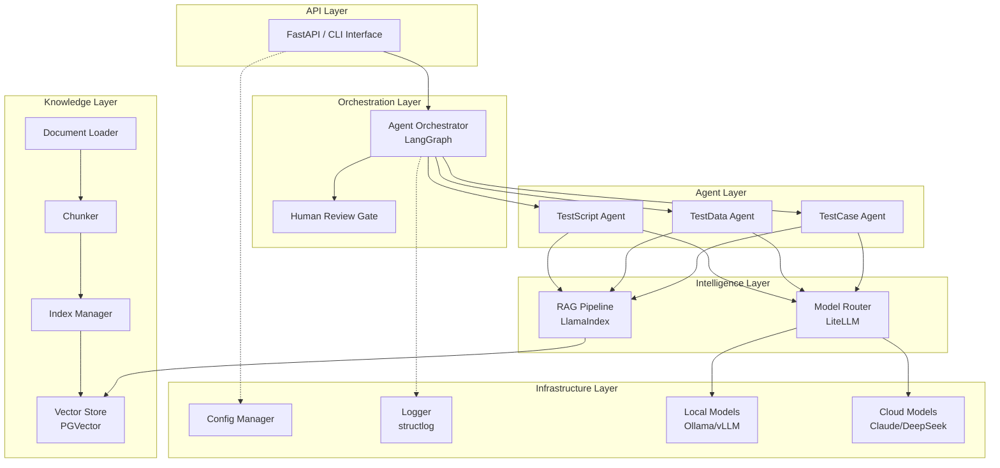
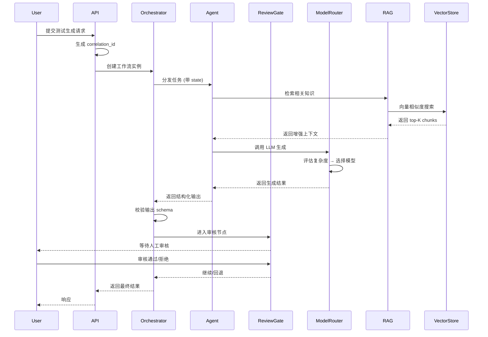

# Design Document: Code Factory

## Overview

QA Code Factory 是一个企业级智能测试自动化平台，采用 Multi-Agent 协作与 RAG 技术实现测试用例智能生成。本设计文档覆盖 Phase 1 的系统架构、组件设计、数据模型与集成模式。

### 设计目标

- **模块化架构**：各组件松耦合，支持独立开发、测试与部署
- **本地优先**：敏感数据优先使用本地模型处理，保障数据安全
- **可扩展性**：支持新 Agent、新文档格式、新模型的快速接入
- **可观测性**：全链路结构化日志与 correlation_id 追踪

### 技术栈选型

| 层级 | 技术选型 | 理由 |
|------|----------|------|
| 包管理 | Poetry / uv | Python 生态主流，lockfile 保证可复现 |
| Agent 编排 | LangGraph | 支持有状态 DAG 工作流、条件边、中断点 |
| LLM 路由 | LiteLLM | 统一接口适配 100+ 模型提供商，内置路由/重试 |
| RAG 框架 | LlamaIndex | 成熟的索引/检索/生成管道，支持混合检索 |
| 向量数据库 | PGVector (PostgreSQL) | 与现有 PG 基础设施复用，支持元数据过滤 |
| 配置管理 | Pydantic Settings | 类型安全的环境变量加载与校验 |
| 日志 | structlog | 结构化 JSON 日志，支持 context binding |

## Architecture

### 系统分层架构



### 项目目录结构

```
code-factory/
├── pyproject.toml
├── .env.example
├── README.md
├── config/
│   ├── settings.yaml          # 通用配置
│   ├── routing_rules.yaml     # 模型路由规则
│   ├── review_gates.yaml      # 审核节点配置
│   └── environments/
│       ├── development.yaml
│       ├── testing.yaml
│       └── production.yaml
├── src/
│   ├── __init__.py
│   ├── main.py                # 应用入口
│   └── core/
│       ├── config.py          # Pydantic Settings
│       ├── logging.py         # structlog 配置
│       └── exceptions.py      # 自定义异常
├── agents/
│   ├── __init__.py
│   ├── orchestrator.py        # LangGraph 编排引擎
│   ├── base_agent.py          # Agent 基类
│   ├── testcase_agent.py
│   ├── testdata_agent.py
│   └── testscript_agent.py
├── rag/
│   ├── __init__.py
│   ├── pipeline.py            # RAG 主管道
│   ├── document_loader.py     # 文档加载器
│   ├── chunker.py             # 智能分块
│   ├── index_manager.py       # 索引管理
│   └── retriever.py           # 检索策略
├── tools/
│   ├── __init__.py
│   ├── model_router.py        # LiteLLM 路由
│   └── review_gate.py         # 审核机制
├── tests/
│   ├── __init__.py
│   ├── unit/
│   ├── integration/
│   └── property/
└── docs/
    └── architecture.md
```

### 请求处理流程



## Components and Interfaces

### 1. Model Router (模型路由)

```python
from abc import ABC, abstractmethod
from dataclasses import dataclass
from enum import Enum
from typing import Any

class ModelTier(Enum):
    LOCAL = "local"
    CLOUD = "cloud"

class TaskComplexity(Enum):
    LOW = "low"
    MEDIUM = "medium"
    HIGH = "high"

@dataclass
class RoutingRule:
    """模型路由规则"""
    complexity: TaskComplexity
    tier: ModelTier
    models: list[str]  # 按优先级排序的模型列表
    max_retries: int = 3

@dataclass
class LLMRequest:
    """LLM 调用请求"""
    messages: list[dict[str, str]]
    task_type: str
    complexity: TaskComplexity
    temperature: float = 0.7
    max_tokens: int = 4096

@dataclass
class LLMResponse:
    """LLM 调用响应"""
    content: str
    model_used: str
    tier: ModelTier
    token_count: dict[str, int]  # {"input": N, "output": M}
    latency_ms: float

class ModelRouterInterface(ABC):
    @abstractmethod
    async def route(self, request: LLMRequest) -> LLMResponse:
        """根据路由规则选择模型并调用"""
        ...

    @abstractmethod
    def classify_complexity(self, task_type: str, context: dict) -> TaskComplexity:
        """评估任务复杂度"""
        ...
```

### 2. Agent Orchestrator (编排引擎)

```python
from abc import ABC, abstractmethod
from dataclasses import dataclass, field
from typing import Any
from enum import Enum

class WorkflowStatus(Enum):
    PENDING = "pending"
    RUNNING = "running"
    WAITING_REVIEW = "waiting_review"
    COMPLETED = "completed"
    FAILED = "failed"

@dataclass
class AgentState:
    """Agent 间传递的状态对象"""
    task_id: str
    correlation_id: str
    workflow_id: str
    input_data: dict[str, Any]
    output_data: dict[str, Any] = field(default_factory=dict)
    metadata: dict[str, Any] = field(default_factory=dict)
    history: list[dict[str, Any]] = field(default_factory=list)

@dataclass
class AgentInvocationLog:
    """Agent 调用日志"""
    agent_name: str
    input_summary: str
    output_summary: str
    model_used: str
    token_count: dict[str, int]
    latency_ms: float
    status: str
    correlation_id: str

class AgentInterface(ABC):
    @abstractmethod
    async def execute(self, state: AgentState) -> AgentState:
        """执行 Agent 任务，返回更新后的状态"""
        ...

    @abstractmethod
    def validate_output(self, state: AgentState) -> bool:
        """校验输出是否符合 schema"""
        ...

class OrchestratorInterface(ABC):
    @abstractmethod
    async def run_workflow(self, workflow_name: str, initial_state: AgentState) -> AgentState:
        """执行完整工作流"""
        ...

    @abstractmethod
    def register_agent(self, name: str, agent: AgentInterface) -> None:
        """注册 Agent 到编排引擎"""
        ...
```

### 3. Human Review Gate (审核机制)

```python
from abc import ABC, abstractmethod
from dataclasses import dataclass
from datetime import datetime
from enum import Enum
from typing import Optional

class ReviewDecision(Enum):
    APPROVED = "approved"
    REJECTED = "rejected"
    PENDING = "pending"

@dataclass
class ReviewRequest:
    """审核请求"""
    request_id: str
    workflow_id: str
    agent_name: str
    content: dict
    created_at: datetime
    timeout_seconds: int

@dataclass
class ReviewRecord:
    """审核记录"""
    request_id: str
    reviewer_id: str
    decision: ReviewDecision
    comments: str
    timestamp: datetime

class ReviewGateInterface(ABC):
    @abstractmethod
    async def submit_for_review(self, request: ReviewRequest) -> str:
        """提交内容等待审核，返回 request_id"""
        ...

    @abstractmethod
    async def get_decision(self, request_id: str) -> Optional[ReviewRecord]:
        """获取审核结果"""
        ...

    @abstractmethod
    async def record_decision(self, record: ReviewRecord) -> None:
        """记录审核决策"""
        ...
```

### 4. Document Loader (文档加载器)

```python
from abc import ABC, abstractmethod
from dataclasses import dataclass
from enum import Enum
from typing import Any

class DocumentFormat(Enum):
    PDF = "pdf"
    MARKDOWN = "markdown"
    WORD = "word"
    SWAGGER_JSON = "swagger_json"
    SWAGGER_YAML = "swagger_yaml"
    PYTHON = "python"
    JAVA = "java"
    JAVASCRIPT = "javascript"
    TYPESCRIPT = "typescript"

@dataclass
class DocumentUnit:
    """文档逻辑单元"""
    content: str
    unit_type: str  # "heading", "code_block", "table", "api_endpoint", "function", "class"
    metadata: dict[str, Any]
    source_path: str
    position: int  # 在文档中的位置序号

@dataclass
class LoadedDocument:
    """加载后的文档"""
    source_path: str
    format: DocumentFormat
    units: list[DocumentUnit]
    raw_text: str
    structural_info: dict[str, Any]  # 保留的结构信息

class DocumentLoaderInterface(ABC):
    @abstractmethod
    def load(self, file_path: str) -> LoadedDocument:
        """加载文档并提取结构化内容"""
        ...

    @abstractmethod
    def supports_format(self, file_path: str) -> bool:
        """检查是否支持该文件格式"""
        ...
```

### 5. Chunker (智能分块)

```python
from abc import ABC, abstractmethod
from dataclasses import dataclass
from typing import Any

@dataclass
class ChunkMetadata:
    """分块元数据"""
    project_name: str
    module_name: str
    document_version: str
    content_type: str  # "requirement", "bug", "api", "test_case", "code_specification"
    source_path: str
    chunk_position: int

@dataclass
class Chunk:
    """文档分块"""
    chunk_id: str  # 基于 source_path + position + version 生成
    content: str
    metadata: ChunkMetadata
    token_count: int

@dataclass
class ChunkConfig:
    """分块配置"""
    max_tokens: int = 512
    overlap_tokens: int = 50
    code_block_max_tokens: int = 2048

class ChunkerInterface(ABC):
    @abstractmethod
    def chunk_document(self, document: 'LoadedDocument', config: ChunkConfig) -> list[Chunk]:
        """将文档拆分为语义完整的分块"""
        ...

    @abstractmethod
    def generate_chunk_id(self, source_path: str, position: int, version: str) -> str:
        """生成唯一分块标识"""
        ...
```

### 6. Vector Store & Index Manager (向量存储与索引管理)

```python
from abc import ABC, abstractmethod
from dataclasses import dataclass
from datetime import datetime
from typing import Any, Optional

@dataclass
class EmbeddingRecord:
    """嵌入记录"""
    chunk_id: str
    embedding: list[float]
    content: str
    metadata: dict[str, Any]

@dataclass
class SearchResult:
    """搜索结果"""
    chunk_id: str
    content: str
    metadata: dict[str, Any]
    similarity_score: float

@dataclass
class IndexUpdateLog:
    """索引更新日志"""
    timestamp: datetime
    operation: str  # "add", "update", "delete"
    affected_documents: list[str]
    chunks_added: int
    chunks_removed: int
    chunks_updated: int

class VectorStoreInterface(ABC):
    @abstractmethod
    async def upsert(self, records: list[EmbeddingRecord]) -> int:
        """插入或更新嵌入记录"""
        ...

    @abstractmethod
    async def search(
        self,
        query_embedding: list[float],
        top_k: int = 5,
        metadata_filter: Optional[dict[str, Any]] = None
    ) -> list[SearchResult]:
        """相似度搜索"""
        ...

    @abstractmethod
    async def delete_by_document(self, source_path: str) -> int:
        """删除指定文档的所有分块"""
        ...

class IndexManagerInterface(ABC):
    @abstractmethod
    async def update_index(self, documents: list['LoadedDocument']) -> IndexUpdateLog:
        """增量更新索引"""
        ...

    @abstractmethod
    async def detect_changes(self, document: 'LoadedDocument') -> dict[str, list[str]]:
        """检测文档变更，返回 {"added": [...], "modified": [...], "deleted": [...]}"""
        ...
```

### 7. RAG Pipeline (检索增强生成管道)

```python
from abc import ABC, abstractmethod
from dataclasses import dataclass
from enum import Enum
from typing import Any, Optional

class RetrievalStrategy(Enum):
    DENSE = "dense"
    SPARSE = "sparse"  # BM25
    HYBRID = "hybrid"

@dataclass
class RAGQuery:
    """RAG 查询"""
    query_text: str
    strategy: RetrievalStrategy = RetrievalStrategy.HYBRID
    top_k: int = 5
    similarity_threshold: float = 0.7
    metadata_filter: Optional[dict[str, Any]] = None

@dataclass
class RAGContext:
    """检索到的上下文"""
    chunks: list['SearchResult']
    is_grounded: bool  # 是否有足够相关上下文
    source_citations: list[str]  # chunk_id 列表

@dataclass
class RAGResponse:
    """RAG 生成响应"""
    content: str
    context: RAGContext
    is_grounded: bool
    citations: list[str]

class RAGPipelineInterface(ABC):
    @abstractmethod
    async def retrieve(self, query: RAGQuery) -> RAGContext:
        """检索相关上下文"""
        ...

    @abstractmethod
    async def generate(self, query: RAGQuery, context: RAGContext) -> RAGResponse:
        """基于上下文生成响应"""
        ...

    @abstractmethod
    async def query(self, query: RAGQuery) -> RAGResponse:
        """端到端 RAG 查询（检索 + 生成）"""
        ...
```

### 8. Configuration Manager (配置管理)

```python
from dataclasses import dataclass
from typing import Optional
from enum import Enum

class Environment(Enum):
    DEVELOPMENT = "development"
    TESTING = "testing"
    PRODUCTION = "production"

@dataclass
class DatabaseConfig:
    host: str
    port: int
    database: str
    user: str
    password: str  # 从环境变量加载

@dataclass
class ModelConfig:
    local_endpoint: str  # Ollama/vLLM endpoint
    cloud_api_keys: dict[str, str]  # provider -> key
    default_temperature: float = 0.7
    default_max_tokens: int = 4096

@dataclass
class AppConfig:
    environment: Environment
    database: DatabaseConfig
    model: ModelConfig
    log_level: str = "INFO"
    vector_store_collection: str = "knowledge_base"
    similarity_threshold: float = 0.7
    review_timeout_seconds: int = 3600
```

## Data Models

### 数据库 Schema (PostgreSQL + PGVector)

```sql
-- 启用 pgvector 扩展
CREATE EXTENSION IF NOT EXISTS vector;

-- 文档元数据表
CREATE TABLE documents (
    id UUID PRIMARY KEY DEFAULT gen_random_uuid(),
    source_path VARCHAR(1024) NOT NULL UNIQUE,
    format VARCHAR(50) NOT NULL,
    version VARCHAR(100) NOT NULL,
    content_hash VARCHAR(64) NOT NULL,  -- SHA-256 用于变更检测
    loaded_at TIMESTAMP WITH TIME ZONE DEFAULT NOW(),
    updated_at TIMESTAMP WITH TIME ZONE DEFAULT NOW()
);

-- 分块表（含向量嵌入）
CREATE TABLE chunks (
    id VARCHAR(256) PRIMARY KEY,  -- 基于 path + position + version 生成
    document_id UUID NOT NULL REFERENCES documents(id) ON DELETE CASCADE,
    content TEXT NOT NULL,
    embedding vector(1536),  -- OpenAI ada-002 维度，可配置
    token_count INTEGER NOT NULL,
    chunk_position INTEGER NOT NULL,
    -- 元数据字段
    project_name VARCHAR(200),
    module_name VARCHAR(200),
    document_version VARCHAR(100),
    content_type VARCHAR(50),  -- requirement, bug, api, test_case, code_specification
    created_at TIMESTAMP WITH TIME ZONE DEFAULT NOW()
);

-- 向量搜索索引
CREATE INDEX idx_chunks_embedding ON chunks
    USING ivfflat (embedding vector_cosine_ops) WITH (lists = 100);

-- 元数据过滤索引
CREATE INDEX idx_chunks_project ON chunks(project_name);
CREATE INDEX idx_chunks_content_type ON chunks(content_type);
CREATE INDEX idx_chunks_module ON chunks(module_name);

-- 索引更新日志表
CREATE TABLE index_update_logs (
    id UUID PRIMARY KEY DEFAULT gen_random_uuid(),
    operation VARCHAR(20) NOT NULL,  -- add, update, delete
    affected_documents TEXT[] NOT NULL,
    chunks_added INTEGER DEFAULT 0,
    chunks_removed INTEGER DEFAULT 0,
    chunks_updated INTEGER DEFAULT 0,
    executed_at TIMESTAMP WITH TIME ZONE DEFAULT NOW()
);

-- 审核记录表
CREATE TABLE review_records (
    id UUID PRIMARY KEY DEFAULT gen_random_uuid(),
    request_id VARCHAR(256) NOT NULL,
    workflow_id VARCHAR(256) NOT NULL,
    agent_name VARCHAR(100) NOT NULL,
    content JSONB NOT NULL,
    reviewer_id VARCHAR(200),
    decision VARCHAR(20),  -- approved, rejected, pending
    comments TEXT,
    created_at TIMESTAMP WITH TIME ZONE DEFAULT NOW(),
    decided_at TIMESTAMP WITH TIME ZONE,
    timeout_seconds INTEGER NOT NULL DEFAULT 3600
);

-- 工作流执行日志表
CREATE TABLE workflow_logs (
    id UUID PRIMARY KEY DEFAULT gen_random_uuid(),
    workflow_id VARCHAR(256) NOT NULL,
    correlation_id VARCHAR(256) NOT NULL,
    agent_name VARCHAR(100) NOT NULL,
    input_summary TEXT,
    output_summary TEXT,
    model_used VARCHAR(100),
    token_count JSONB,  -- {"input": N, "output": M}
    latency_ms FLOAT,
    status VARCHAR(20) NOT NULL,
    created_at TIMESTAMP WITH TIME ZONE DEFAULT NOW()
);

CREATE INDEX idx_workflow_logs_correlation ON workflow_logs(correlation_id);
CREATE INDEX idx_workflow_logs_workflow ON workflow_logs(workflow_id);
```

### 配置文件格式

**routing_rules.yaml:**
```yaml
routing:
  rules:
    - task_type: "test_case_generation"
      complexity_threshold: "medium"
      local_models:
        - "ollama/qwen2.5:32b"
        - "ollama/deepseek-coder-v2:16b"
      cloud_models:
        - "claude-3-5-sonnet-20241022"
        - "deepseek/deepseek-chat"
    - task_type: "test_data_generation"
      complexity_threshold: "low"
      local_models:
        - "ollama/qwen2.5:14b"
      cloud_models:
        - "deepseek/deepseek-chat"
  fallback:
    max_retries: 3
    retry_delay_seconds: 2
    escalation_enabled: true
```

**review_gates.yaml:**
```yaml
review_gates:
  workflows:
    test_case_generation:
      review_points:
        - after_agent: "testcase_agent"
          required: true
          timeout_seconds: 3600
    test_script_generation:
      review_points:
        - after_agent: "testscript_agent"
          required: true
          timeout_seconds: 7200
  notifications:
    reminder_interval_seconds: 1800
    channels:
      - type: "webhook"
        url: "${REVIEW_WEBHOOK_URL}"
```


## Correctness Properties

*A property is a characteristic or behavior that should hold true across all valid executions of a system—essentially, a formal statement about what the system should do. Properties serve as the bridge between human-readable specifications and machine-verifiable correctness guarantees.*

### Property 1: Model routing respects complexity classification

*For any* LLM request with a defined task complexity, the Model Router SHALL route low-complexity tasks to local-tier models and high-complexity tasks to cloud-tier models, consistent with the configured routing rules.

**Validates: Requirements 2.4, 2.5**

### Property 2: Model retry stays within same tier

*For any* model invocation that fails due to endpoint unavailability, the Model Router SHALL retry with alternative models from the same tier, making at most 3 total attempts before considering the tier exhausted.

**Validates: Requirements 2.7**

### Property 3: Model tier escalation on exhaustion

*For any* tier where all configured model endpoints are unavailable, the Model Router SHALL escalate the request to the next tier and produce a warning log entry.

**Validates: Requirements 2.8**

### Property 4: Agent state integrity through workflow

*For any* AgentState object passed between agents in a workflow, the state's immutable fields (task_id, correlation_id, workflow_id) SHALL remain unchanged, and the history SHALL be append-only (previous entries never modified).

**Validates: Requirements 3.3**

### Property 5: Agent output validation with retry

*For any* agent that produces output failing schema validation, the Orchestrator SHALL retry that agent exactly up to 2 times. If all retries produce invalid output, the task SHALL be marked as failed. If any retry produces valid output, execution SHALL continue.

**Validates: Requirements 3.4, 3.5**

### Property 6: Agent invocation logging completeness

*For any* agent invocation within a workflow, the system SHALL produce a log entry containing all required fields: agent name, input summary, output summary, model used, token count, and latency in milliseconds.

**Validates: Requirements 3.6, 10.3**

### Property 7: Rejection feedback propagation

*For any* human review rejection with feedback comments, the Agent Orchestrator SHALL route the task back to the originating agent with the reviewer's feedback included in the agent's input state.

**Validates: Requirements 4.3**

### Property 8: Review record completeness

*For any* review decision (approved or rejected), the Human Review Gate SHALL persist a record containing reviewer identity, timestamp, and comments, with no fields left null.

**Validates: Requirements 4.6**

### Property 9: Swagger endpoint extraction as separate units

*For any* valid OpenAPI/Swagger specification, the Document Loader SHALL extract each API endpoint as a separate DocumentUnit containing method, path, parameters, and response schema information.

**Validates: Requirements 5.3**

### Property 10: Source code logical unit extraction

*For any* valid Python source code file, the Document Loader SHALL extract each function, class, and docstring as a separate DocumentUnit with correct unit_type classification.

**Validates: Requirements 5.4**

### Property 11: Unsupported format rejection

*For any* file with an unsupported format extension, the Document Loader SHALL reject the file with an error message that lists the supported formats.

**Validates: Requirements 5.5**

### Property 12: Semantic chunking preserves boundaries

*For any* document containing sentences and code blocks, the Chunker SHALL never produce a chunk that splits mid-sentence or mid-code-block.

**Validates: Requirements 6.1**

### Property 13: Chunk metadata completeness

*For any* chunk produced by the Chunker, all metadata fields (project_name, module_name, document_version, content_type) SHALL be populated with non-empty values.

**Validates: Requirements 6.2**

### Property 14: Chunk size respects type-specific limits

*For any* chunk produced by the Chunker, if the chunk contains a code block it SHALL be at most 2048 tokens as a single unit; otherwise it SHALL be at most 512 tokens. Adjacent non-code chunks SHALL have approximately 50 tokens of overlap.

**Validates: Requirements 6.3, 6.4**

### Property 15: Table rows preserve header context

*For any* document containing tables, the Chunker SHALL produce chunks where each table row includes the table header row as context.

**Validates: Requirements 6.5**

### Property 16: Chunk ID determinism and uniqueness

*For any* two distinct (source_path, chunk_position, document_version) tuples, the generated chunk IDs SHALL be different. For the same tuple, the generated chunk ID SHALL always be identical (deterministic).

**Validates: Requirements 6.6**

### Property 17: Vector store storage round-trip

*For any* EmbeddingRecord stored in the Vector Store, retrieving it by chunk_id SHALL return the same embedding vector, metadata, and original text content.

**Validates: Requirements 7.2**

### Property 18: Top-K search returns exactly K ordered results

*For any* similarity search with a specified K value against a store containing at least K records, the Vector Store SHALL return exactly K results ordered by descending similarity score.

**Validates: Requirements 7.3**

### Property 19: Incremental index detects changes correctly

*For any* document that has been modified (sections added, changed, or removed), the Index Manager SHALL correctly identify the changed sections and only re-index those sections, leaving unchanged chunks intact.

**Validates: Requirements 7.6**

### Property 20: Document deletion removes all chunks

*For any* document deleted from the knowledge base, the Index Manager SHALL remove all associated chunks from the Vector Store, leaving zero chunks with that document's source_path.

**Validates: Requirements 7.7**

### Property 21: Index update produces complete log entry

*For any* index update operation (add, update, or delete), the Index Manager SHALL produce a log entry containing timestamp, list of affected documents, and accurate chunk count changes.

**Validates: Requirements 7.8**

### Property 22: Metadata filter returns only matching chunks

*For any* RAG query with metadata filters (project, module, or content_type), all returned chunks SHALL have metadata values matching the specified filter criteria.

**Validates: Requirements 8.3**

### Property 23: RAG response includes source citations

*For any* RAG-generated response that uses retrieved context chunks, the response SHALL include chunk identifiers as citations for all chunks used in generation.

**Validates: Requirements 8.4**

### Property 24: Below-threshold queries marked as ungrounded

*For any* RAG query where no retrieved chunks exceed the configured similarity threshold, the response SHALL be marked as ungrounded (is_grounded=false) and include a notice to the user.

**Validates: Requirements 8.6**

### Property 25: Configuration validation reports all issues

*For any* configuration dictionary with missing or invalid required fields, the validator SHALL report all issues (not just the first one) with descriptive error messages identifying each problematic field.

**Validates: Requirements 9.3**

### Property 26: Structured log format consistency

*For any* log event emitted by the system, the output SHALL be valid JSON containing all required fields (timestamp, level, module, message, correlation_id), and the correlation_id SHALL be consistent across all log entries within the same request.

**Validates: Requirements 10.1, 10.2**

### Property 27: Exception logging preserves context

*For any* unhandled exception occurring within a request context, the system SHALL produce an ERROR-level log entry containing the full stack trace and the request's correlation_id.

**Validates: Requirements 10.5**

## Error Handling

### 错误处理策略

| 组件 | 错误类型 | 处理策略 |
|------|----------|----------|
| Model Router | 端点不可用 | 同层重试 → 跨层升级 → 最终失败 |
| Model Router | 速率限制 | 指数退避重试 |
| Agent Orchestrator | 输出校验失败 | 重试 2 次 → 标记失败 |
| Agent Orchestrator | Agent 超时 | 取消当前执行 → 重试 |
| Document Loader | 格式不支持 | 拒绝并返回描述性错误 |
| Document Loader | 文件损坏 | 记录错误，继续处理其他文件 |
| Chunker | 超大代码块 (>2048 tokens) | 按函数/类边界强制分割 |
| Vector Store | 连接失败 | 重试 3 次，指数退避 |
| RAG Pipeline | 无相关结果 | 标记为 ungrounded，继续生成 |
| Config Manager | 缺少必需配置 | 启动时终止，非零退出码 |
| Human Review Gate | 审核超时 | 发送提醒通知 |

### 异常层次结构

```python
class CodeFactoryError(Exception):
    """基础异常类"""
    def __init__(self, message: str, correlation_id: str = None):
        self.correlation_id = correlation_id
        super().__init__(message)

class ModelRoutingError(CodeFactoryError):
    """模型路由错误"""
    pass

class ModelTierExhaustedError(ModelRoutingError):
    """某一层级所有模型不可用"""
    def __init__(self, tier: str, attempts: int, **kwargs):
        self.tier = tier
        self.attempts = attempts
        super().__init__(f"All models in tier '{tier}' exhausted after {attempts} attempts", **kwargs)

class AgentExecutionError(CodeFactoryError):
    """Agent 执行错误"""
    pass

class SchemaValidationError(AgentExecutionError):
    """输出 schema 校验失败"""
    def __init__(self, agent_name: str, errors: list[str], **kwargs):
        self.agent_name = agent_name
        self.validation_errors = errors
        super().__init__(f"Agent '{agent_name}' output validation failed: {errors}", **kwargs)

class DocumentLoadError(CodeFactoryError):
    """文档加载错误"""
    pass

class UnsupportedFormatError(DocumentLoadError):
    """不支持的文档格式"""
    def __init__(self, file_path: str, supported_formats: list[str], **kwargs):
        self.file_path = file_path
        self.supported_formats = supported_formats
        super().__init__(
            f"Unsupported format for '{file_path}'. Supported: {supported_formats}",
            **kwargs
        )

class ConfigurationError(CodeFactoryError):
    """配置错误"""
    pass

class MissingConfigError(ConfigurationError):
    """缺少必需配置"""
    def __init__(self, missing_fields: list[str], **kwargs):
        self.missing_fields = missing_fields
        super().__init__(f"Missing required config: {missing_fields}", **kwargs)
```

### 重试策略

```python
from dataclasses import dataclass

@dataclass
class RetryPolicy:
    """重试策略配置"""
    max_attempts: int
    base_delay_seconds: float = 1.0
    max_delay_seconds: float = 30.0
    exponential_base: float = 2.0
    retryable_exceptions: tuple = ()

# 各组件默认重试策略
MODEL_RETRY_POLICY = RetryPolicy(
    max_attempts=3,
    base_delay_seconds=2.0,
    retryable_exceptions=(ConnectionError, TimeoutError)
)

AGENT_RETRY_POLICY = RetryPolicy(
    max_attempts=2,
    base_delay_seconds=0,  # 立即重试
    retryable_exceptions=(SchemaValidationError,)
)

VECTOR_STORE_RETRY_POLICY = RetryPolicy(
    max_attempts=3,
    base_delay_seconds=1.0,
    exponential_base=2.0,
    retryable_exceptions=(ConnectionError,)
)
```

## Testing Strategy

### 测试分层

```
┌─────────────────────────────────────────┐
│         E2E Tests (少量)                 │
│   完整工作流端到端验证                    │
├─────────────────────────────────────────┤
│       Integration Tests (适量)           │
│   组件间集成、数据库交互、外部服务         │
├─────────────────────────────────────────┤
│       Property Tests (核心逻辑)          │
│   27 个正确性属性的 PBT 验证             │
├─────────────────────────────────────────┤
│       Unit Tests (大量)                  │
│   单个函数/方法的具体行为验证             │
└─────────────────────────────────────────┘
```

### Property-Based Testing 配置

- **框架**: [Hypothesis](https://hypothesis.readthedocs.io/) (Python 生态最成熟的 PBT 库)
- **最小迭代次数**: 100 次/属性
- **标签格式**: `# Feature: code-factory, Property {N}: {property_text}`
- **每个正确性属性对应一个 property-based test**

### 测试目录结构

```
tests/
├── unit/
│   ├── test_model_router.py
│   ├── test_chunker.py
│   ├── test_document_loader.py
│   ├── test_index_manager.py
│   ├── test_config.py
│   └── test_logging.py
├── property/
│   ├── test_routing_properties.py      # Properties 1-3
│   ├── test_orchestrator_properties.py # Properties 4-6
│   ├── test_review_properties.py       # Properties 7-8
│   ├── test_loader_properties.py       # Properties 9-11
│   ├── test_chunker_properties.py      # Properties 12-16
│   ├── test_vectorstore_properties.py  # Properties 17-21
│   ├── test_rag_properties.py          # Properties 22-24
│   ├── test_config_properties.py       # Property 25
│   └── test_logging_properties.py      # Properties 26-27
├── integration/
│   ├── test_pgvector_integration.py
│   ├── test_litellm_integration.py
│   ├── test_langgraph_workflow.py
│   └── test_rag_pipeline.py
└── conftest.py
```

### 关键测试策略

**Unit Tests** 聚焦:
- 具体的边界条件和错误场景
- 配置加载的具体示例
- 各 Loader 对特定文件格式的解析
- 路由规则的具体配置场景

**Property Tests** 聚焦:
- 路由逻辑的正确性（任意复杂度 → 正确层级）
- 分块逻辑的不变量（语义完整性、大小限制、元数据完整性）
- 索引管理的增量更新正确性
- 日志格式的结构一致性
- 向量存储的 round-trip 正确性

**Integration Tests** 聚焦:
- PGVector 实际连接与查询
- LiteLLM 与 Ollama/云端模型的实际调用
- LangGraph 工作流的实际执行
- 完整 RAG 管道的端到端检索

### Hypothesis 配置示例

```python
# conftest.py
from hypothesis import settings, HealthCheck

settings.register_profile(
    "ci",
    max_examples=200,
    suppress_health_check=[HealthCheck.too_slow],
)
settings.register_profile(
    "dev",
    max_examples=100,
)
settings.load_profile("dev")
```

### 依赖项

```toml
[tool.poetry.group.test.dependencies]
pytest = "^8.0"
pytest-asyncio = "^0.23"
hypothesis = "^6.100"
pytest-cov = "^5.0"
factory-boy = "^3.3"  # 测试数据工厂
```
